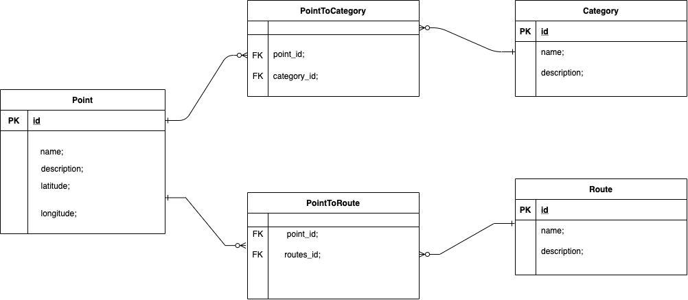

#Поиск маршрута для отдыха.

# Table of Contents
1. [Overview](#Overview)
2. [Functional Requirements](#Functional-Requirements)
3. [Non-Functional Attributes](#Non-Functional-Attributes)
4. [ERD](#ERD)

### Overview

### Functional-Requirements

Типи маршрутів по способу транспортування:
- Пеший маршрут
- автомобильный
- вело

Типи маршрутів по локації
- ~~Маршрут на природе~~
- ~~Маршрут по городу~~

Типи маршрутів по віку 
- ~~С детьми~~
- ~~без детей~~

Типи маршрутів по часу
- многодневный
- однодневный

Если многодневный:
- ночевка в отеле;
- в палатке;

Для какого количества человек?
- 1
- 2
- группа людей

Если город:
- достопримечательности-визитки;
- религиозные;
- гастротуризм;
- алкогольный;
- безалкогольный;
- посещение театра, оперы.

Если природный:
- Цивилизованный;
- дикий;
- выбор по региону Украины;

Приоритеты:
- набор высот;
- наличие воды( речка, озеро, водопад).
- парк;
- лес;
- прибрежный район;

Расстояние от точки до точки либо затраченное время на переход/переезд.

Желаемое время затраченное на маршрут.

Среднее время пребывания в точке.

Алгоритм пошуку точок:
- вказується точка (координата) міця розкашування юзера або він вказує звідки він хотів би почати (телеграм бот)
- вказується рідус в межах якого робити пошук найближчих точок
- телеграм бот видає список категорій, користувач їх вибирає
- телеграм бот робить вибіргу по місцю розташуванню користувача та категоріях
- телеграм бот повертає користувачу список точок
- користувач має мати змогу видалити якусь точку з цієї вибірки

Ідентифікація запитів
- зберігати історію запитів в профілі
- зберігати юзера по чат ід

## Non-Functional-Attributes

## ERD

